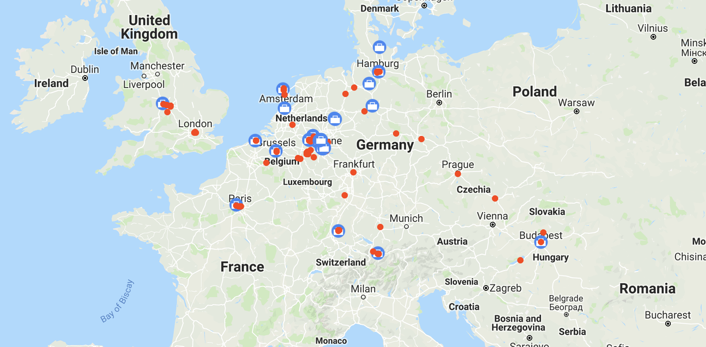
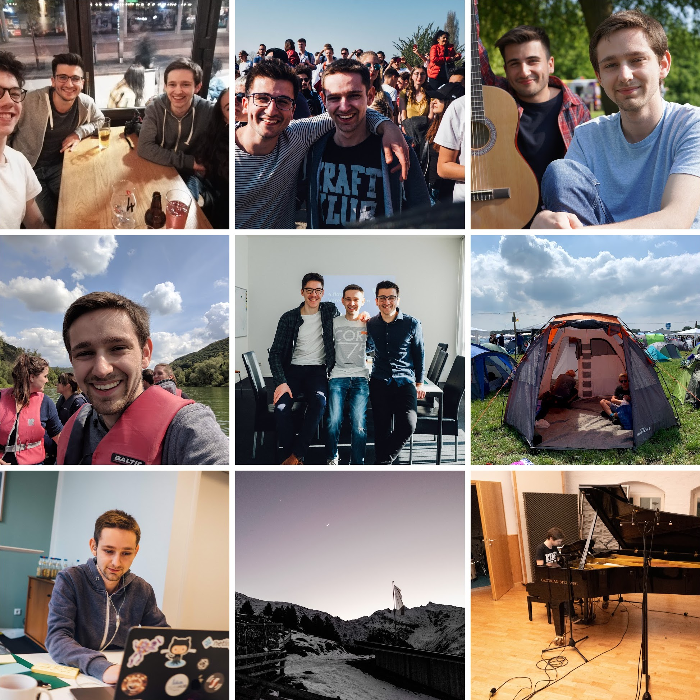
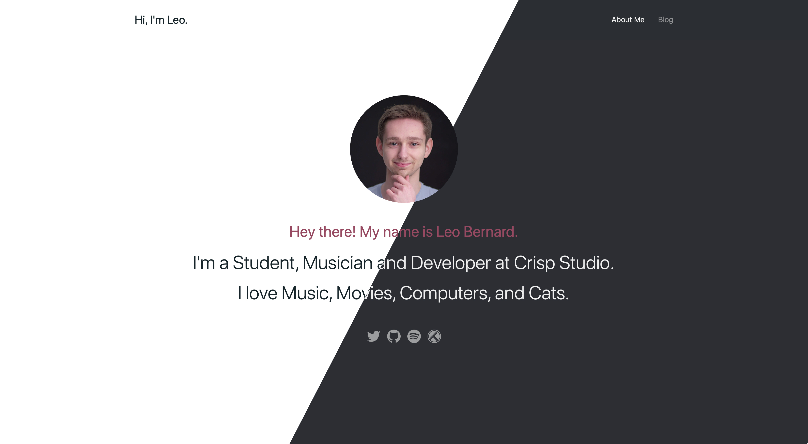

It's been a while since I last updated my blog – or wrote anything at all, for that
matter. Since the [last article](/blog/3dfine-website) in January 2018, I've been
busy with work, studying, and life in general.

## A Lot Has Happened in the Meantime

Since my last update, I've gotten to know the ins and outs of React and Webpack,
GraphQL and Gatsby, Styled Components and Linaria, and Framer and Figma. I've built
some useful tools and libraries using TypeScript, like
[json-autotranslate](https://github.com/leolabs/json-autotranslate),
[You Need A Parser](https://ynap.leolabs.org), and
[AbletonJS](https://github.com/leolabs/ableton.js).

I quit my job at Duplexmedia and started working part-time at Crisp Studio. I've
learned how to do Design Sprints and we held our first
[Design Sprint at Mister Spex](https://betterinbetween.com/mister-spex-%E2%80%93-rethinking-the-way-we-buy-eyewear-today/)
together.

I've practiced
[playing piano and singing](https://www.youtube.com/watch?v=HDHX37WMwWA) and spent a
lot of time with my friends writing and recording our own songs. Officially, our band
doesn't exist yet, but hopefully our first EP will be released later this year.

Last summer, I traveled a lot to visit old friends and to discover new cities. I've
been to several festivals and concerts, and made some new friends along the way.

Together with some friends from Crisp, we recorded an acoustic session of Timo
Brauwers' song [After The Storm](https://www.youtube.com/watch?v=ZyE-fxSrB3A). I also
recorded and edited the sound for
[Not Enough](https://www.youtube.com/watch?v=ZyE-fxSrB3A), a short film that two of
my friends shot as part of their final bachelor's project.

At our university, I finished writing all necessary exams and started writing my
bachelor's thesis on Component Sprints – a way to bridge the gap between Design
Sprints and the development of an MVP.

## My New Blog

I've decided to rebuild my blog from the ground up. It should be minimal and focused
on content while giving you an up-to-date insight into who I am and what I'm
currently up to. I've placed links to my most-used social profiles in focus as those
are the most

The homepage shows which playlists and tracks I'm listening to, and which movies and
series I've watched. The blog is straight-forward. I've transferred all my old posts
over to the new blog, but they're listed in the archive so they won't distract from
the new ones.

In supported browsers (like Safari, at the time of this post), the website will
switch between light and dark mode according to your system preferences.

## Technology

The website is built with [Gatsby](https://gatsbyjs.org/) – an amazing tool to build
super fast websites using React and GraphQL – and its source code is available on
[GitHub](https://github.com/leolabs/leolabs-org), if you'd like to take a look at it.

The blog posts are written in Markdown using
[Netlify CMS](https://www.netlifycms.org/) or [Ulysses](https://ulysses.app/). The
website is hosted on [Netlify](https://www.netlify.com/) and gets deployed every
morning at 3AM to fetch new data from
[Trakt](https://github.com/leolabs/gatsby-source-trakt-tmdb) and
[Spotify](https://github.com/leolabs/gatsby-source-spotify) using two source plugins
I wrote.

I've decided to use [Linaria](https://github.com/callstack/linaria) to style my blog,
as it is the most light-weight CSS-in-JS solution that exists at the moment.

## From Now On

From now on, I'll post more regularly about projects, life, and other thoughts. I'll
try to do at least one post per month for now, but hope to be able to do more in the
future.
