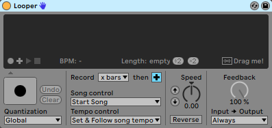
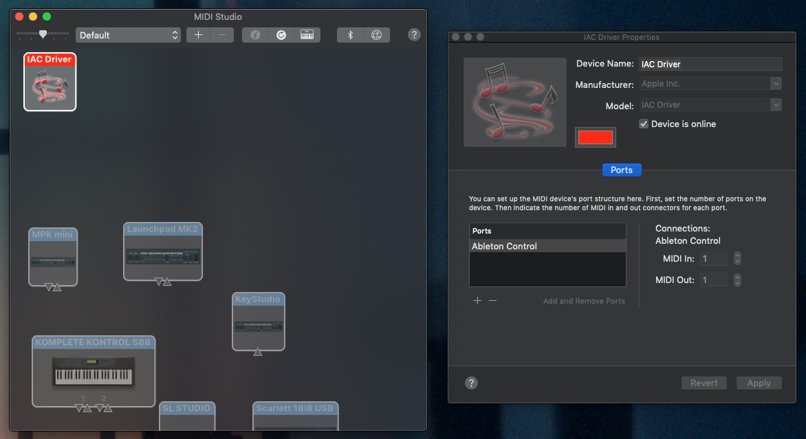
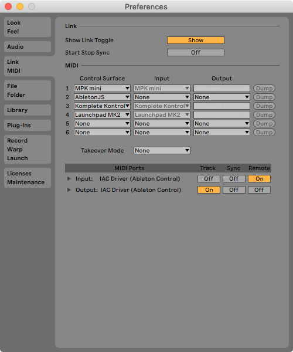
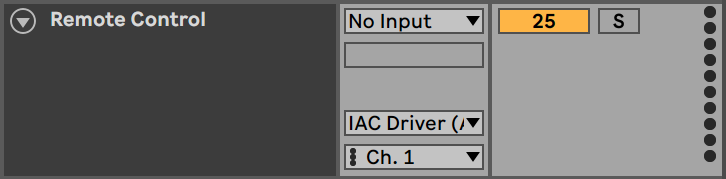
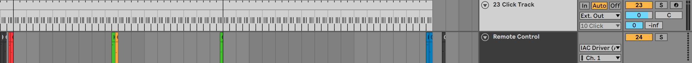

In our live set, we rely heavily on Loopers to build our sound stage. Even though we
use backing tracks sometimes, we still want to perform as much on stage as possible.
However, we don't want to have to control the Loopers ourselves so we can focus
completely on our instruments. So we decided to automate them.

In Ableton Live, you can automate every parameter of every effect using automation
curves. You can't, however, automate button presses like starting or stopping a loop.
After a while of experimenting with different workarounds, I found a simple and
reliable way to automate those button presses.

The concept is fairly simple. We'll map the Looper controls we need to incoming MIDI
notes and create a virtual MIDI device that allows us to send notes to Ableton at
specific points in the set.

## Setting up an IAC Device

This part of the workaround is specific to macOS, but it should be possible to build
a similar setup on Windows.

An IAC Device, or Inter-App Communication Device is a virtual MIDI device that
forwards all MIDI input to its output, allowing you, for example, to send MIDI from
one app to another. In our case, we want to send MIDI from Ableton to Ableton, but
the process is the same.

First, open _Audio MIDI Setup_ and click on _Window > Show MIDI Studio_. The MIDI
Studio allows you to manage all MIDI devices that are connected to your Mac. Click on
the _IAC Driver_ device to open its properties, then make sure that _Device is
online_ is checked and add a new port. I've called mine "Ableton Control", but you're
free to choose your own name.

With that, we have a virtual MIDI device that we can use in Ableton for the next
steps.

## Setting up Ableton

In Ableton, open your MIDI preferences. You should see the IAC Device that you just
created. Enable _Remote_ for the input and _Track_ for the output.

Then, create a new MIDI track in your project, set the input to _No Input_ and the
output to your IAC Device. We'll use this track to send MIDI notes to Ableton.

For the next step, connect a MIDI keyboard to your computer and enable _Remote_ for
it in the settings as well. You can now map the Looper controls you need to incoming
MIDI notes.

I chose to use one octave per Looper so the relative notes could be the same for each
one. Here's the schema I used:

|   C    |   C#    |   D   |  D#   |   E   |
| :----: | :-----: | :---: | :---: | :---: |
| Record | Overdub | Play  | Stop  | Clear |

Last, create clips for each command that contain the notes you mapped in Ableton. You
can now place these clips on the Remote Control track you created earlier to control
your Loopers.

> **Pro Tip**: Enable quantization in your Loopers and place the control clips a
> little bit before where you want them to trigger. This is a workaround for the
> potential latency the IAC Driver causes.

I've color-coded the clips so I can more easily see which action is triggered in the
timeline. This is what it looks like for one of our songs:

That's how we automate Loopers in Ableton. Of course, this technique isn't limited to
controlling Loopers. You could, for example, also use this method to automatically
arm tracks, to toggle MIDI overdubbing, to control input monitoring of tracks, or any
other function that can be mapped to a MIDI note.
