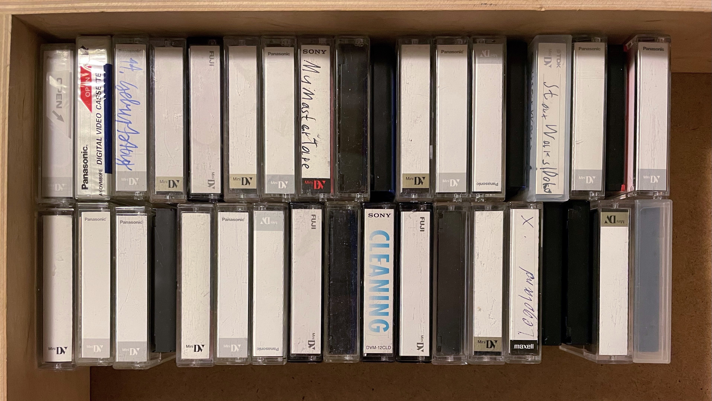
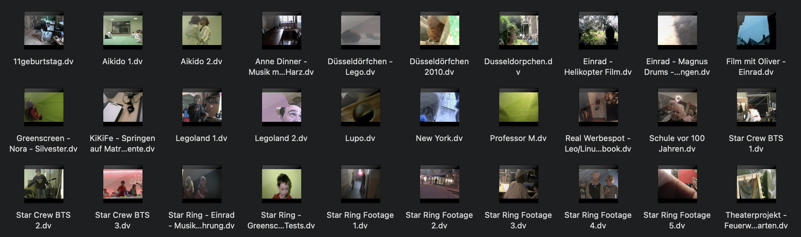

This is a part of a bigger series I'm writing on archiving media in general.

I've spent the past few weeks at my parents' house and wanted to use the time
to digitize and catalog old pictures and videos that they have, to make sure
they don't get lost or unreadable some time in the future. I found a box full
of old MiniDV cassettes and took the challenge to capture them all.



I had three requirements for the process:

- Each MiniDV tape should be captured losslessly, 1:1 into a single file for archival
- Each file should be split into clips that I can later import into my Photos library
- Generated clips should have the correct timestamp based on the date stored on the tapes

This sounded easy at first, but there were a few hurdles to overcome:

## The Player

It's been a long time since I last used a camcorder and I think I threw my old one
away a few years ago after the screen broke. Used MiniDV camcorders are surprisingly
expensive and I didn't want to put too much money into this.

Luckily, a good friend of mine still has an old MiniDV player that he could lend me
for a few weeks – the Sony GV-D1000E (PAL).

## The Connection

Connecting Mini FireWire to a modern MacBook with only USB-C ports takes a few
adapters to achieve:

- [Thunderbolt 3 -> Thunderbolt 2](https://amzn.to/3rpIJSj)
- [Thunderbolt 2 -> FireWire 800](https://amzn.to/3kPwT1v)
- [FireWire 800 -> FireWire 400](https://amzn.to/38il0Ml)
- [FireWire 400 -> Mini FireWire](https://amzn.to/3qoQuXg)

You could also go directly from [FireWire 800 to Mini FireWire](https://amzn.to/2OumLim),
but I already had a 400 -> Mini cable, so I went the longer route.


The little box in the image is a DV Line Protector that prevents power spikes from
frying the connected hardware. Even though that's a long chain of adapters, the
connection is stable and the player was recognized correctly after plugging it in.

## The Software

> You can skip this section if you want to get straight to my solution.

Here's where it got a bit tricky. MiniDV is an old and outdated standard, so there is
not much active software development going on around it. I tried a few programs:

#### Premiere Pro CC

Premiere straight up [doesn't support DV on macOS anymore](https://helpx.adobe.com/x-productkb/multi/video-applications-macos-catalina-compatibility.html#:~:text=no%20longer%20support,over%20FireWire), so no luck.

#### iMovie and Final Cut Pro

iMovie and Final Cut support capturing from MiniDV and write the data straight to
disk without any modification, but they didn't work out for me for two reasons:

1. There was no way to turn down the audio while a tape was being imported
2. Final Cut's scene detection is very eager, splitting clips every time
   there's a slight glitch on the tape or the timecode doesn't line up.

#### QuickTime

The current QuickTime app allows you to capture MiniDV video, but it applies its own
video filters, like deinterlacing, and it doesn't split the video into clips.

#### LifeFlix

This app is developed specifically to capture old MiniDV videos so I had high hopes,
but it also detected the clips wrong sometimes and didn't always extract the correct
dates.

I concluded that using an app might not be the way to go here, so I looked around
the internet and found a project called DV Rescue.

## The DV Rescue Project

[DV Rescue](https://www.mipops.org/dvrescue/) is a project by MIPoPS, the
[Moving Image Preservation of Puget Sound](https://www.mipops.org/). They are focused
on archival and restoration of MiniDV tapes and have open-sourced their work. Last
November, they released a [presentation](https://www.youtube.com/watch?v=YGPIqJ4_ssI)
of the project's current state.

Two tools are specifically interesting for our use case:

- [FFmpeg-Decklink](https://git.io/JqT1T): A modified version of FFmpeg that is able
  to handle MiniDV, even with glitches and errors in the video and audio streams
- [DV Packager](https://git.io/JqT1O): A tool to split the imported data into clips
  based on given parameters, properly aligning audio and video and adding problematic
  timestamps as chapter marks

Both tools don't have a GUI, so we're going to use the Terminal.

## Capturing the MiniDV Tapes

To use the tools, make sure that [Homebrew](https://brew.sh) is installed, then run
the following commands to install them on your machine:

```shell
brew tap amiaopensource/amiaos
brew tap mediaarea/homebrew-mediaarea
brew install ffmpegdecklink dvrescue mediainfo
brew link --force ffmpegdecklink
```

First, check what name your MiniDV player or camcorder is listed as:

```shell
ffmpeg -f avfoundation -list_devices true -i ""
```

This will give an output like this:

```
Asked for all format descriptions...
[...] AVFoundation video devices:
[...] [0] FaceTime HD Camera (Built-in)
[...] [1] DV-VCR
[...] [2] Capture screen 0
[...] AVFoundation audio devices:
[...] [0] MacBook Pro Microphone
```

In my case, the player is called `DV-VCR`.

To capture a tape, insert it, rewind it, and then launch this command:

```shell
ffmpeg-dl -f avfoundation -capture_raw_data true -i "DV-VCR" -c copy -map 0 -f rawvideo video.dv
```

- `-i "DV-VCR"` selects the input device
- `-c copy` tells ffmpeg to not re-encode the file
- `-map 0` specifies that all streams should be saved as-is
- `-f rawvideo` tells ffmpeg that the video stream is raw data
- `video.dv` is the output filename

FFmpeg will now capture the raw data stream and write it to the file. I usually
just leave this running in the background until the tape is finished.

When the whole tape is captured, you'll have one file that contains the raw data.
You can archive this somewhere if you like.



## Splitting the Recordings into Clips

To split the recordings into smaller clips, we're going to use `dvpackager`:

```shell
dvpackager -e mov -s video.dv
```

- `-e mov` sets the output format, this could also be `mkv`
- `-s` means that files will be split by record markers
- `video.dv` is the input file

DV Packager will now go over the video file, correct A/V synchronization, and add
chapter marks for problematic parts. This process will take a while.

After this step, you can go through the clips and sort out unimportant ones. You
could call it a day at this point and save the videos somewhere, but I wanted to
store the clips in Apple Photos and save some storage, so I added a few steps.

## Extra Steps

I wrote some scripts to process the clips that I wanted to add to my library.

#### Convert the Clips to HEVC

Here's a script that deinterlaces all files in the current directory, converts them
into HEVC videos, and adds the recording date to it so that it can be correctly
imported into Photos:

```shell
for f in *.mov
do
  DATE=$(mediainfo --Output="General;%Recorded_Date%" "$f" | cut -c1-19)
  SAFE_DATE=$(echo "$DATE" | sed -e 's/://g' -e 's/ /_/g')
  OUTPUT="$SAFE_DATE"_"${f%.*}.mp4"

  echo "Converting $f..."

  ffmpeg-dl -i "$f" -vf "yadif=mode=send_field:parity=bff" -preset medium \
    -vcodec hevc -tag:v hvc1 -crf 22 -pix_fmt yuv420p -movflags +faststart \
    -c:a aac -b:a 256k -write_tmcd 0 -metadata creation_time="$DATE" \
    -hide_banner "$OUTPUT"
done
```

You can import the resulting files into Photos or Google Photos and they will be
dated correctly, given that your camera's time was set correctly when the clips
were recorded.

#### Just add the Recording Date to the Filename

```shell
for f in *.mov
do
  DATE=$(mediainfo --Output="General;%Recorded_Date%" "$f" | cut -c1-19)
  SAFE_DATE=$(echo "$DATE" | sed -e 's/://g' -e 's/ /_/g')
  mv "$f" "$SAFE_DATE"_"$f"
done
```

This might be practical if you want to further process the video before adding it
to your library. You could, for example, deinterlace it and upscale it to 1080p with
Topas Labs' [Video Enhance AI](https://www.topazlabs.com/video-enhance-ai/ref/925/?campaign=minidv)
using the *Dione Interlaced* algorithm with *Bottom First* field order.

## Conclusion

Even though it took some time, I now have a solid process for archiving MiniDV tapes
and adding them to my Photos library. There are so many precious moments on there and
I'm happy that I invested the time to transfer and catalog them.

If I could talk to my 12-year-old self, I would tell him to not re-use those tapes.
It degrades their quality and overwriting means losing the old material. Still, I'm
happy with the results.

In the next article I'll be writing about the process of cataloging photos from old
hard drives in macOS' Photos app.
