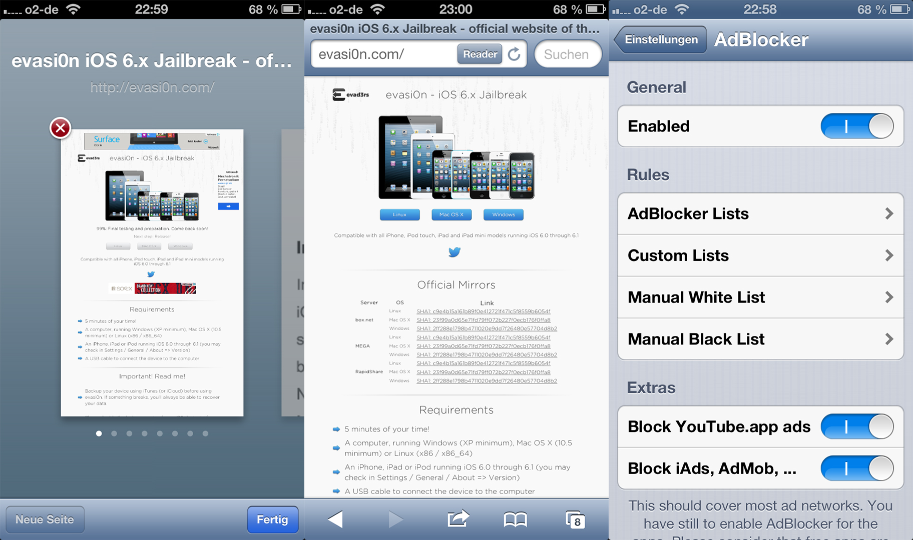
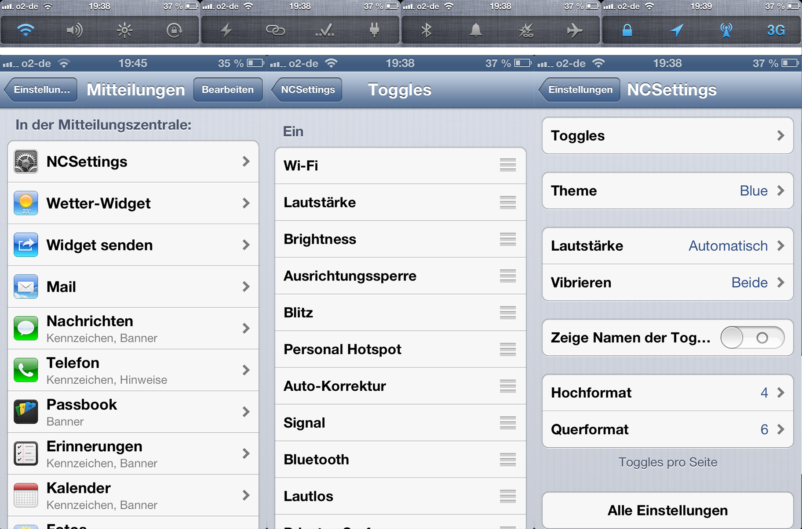

I jailbroke my iPhone 5 with iOS 6.1 this monday and found some nice tools that I want to share with you as I think they could be useful fou you, too. These are my 3 favorite jailbreak tweaks for iOS 6.1.

## First: Auxo

 [Auxo](http://cydia.saurik.com/package/org.thebigboss.auxo "Auxo on the Cydia Store") is a very nice alternative to iOS's integrated task switcher. It displays screenshots of every app instead of just the app's icon and includes toggles to turn on/off wifi or bluetooth, to start or stop the personal hotspot and many more. Below those toggles is a brightness slider which lets you dim the screen without needing to go to the settings. The music player also looks nicer and displays the current song and the current album artwork. It costs about $1.99 on the Cydia Store and is totally worth a try. This tweak had some problems with blank screenshots when I installed it some days ago, but the developers released an update which fixed those problems for me.

## Second: AdBlocker

 [AdBlocker](http://cydia.saurik.com/package/com.yllier.blocker "AdBlocker on the Cydia Store") does exactly what the name says. It blocks advertisements on web pages in Safari and every other browser that uses Apple's web engine. Additionally, it also blocks iAds and AdMob ads in Apps and video advertisements in the YouTube app. This doesn't only look better than with ads, but it also reduces the loading time of websites and videos. This tweak costs $2.19 and does its job very well.

## Third: NCSettings

 [NCSettings](http://cydia.saurik.com/package/com.jamied360.ncsettings "NCSettings in the Cydia Store") is a nice tweak that adds a bunch of settings toggles to your notification center. These include brightness, volume, rotation lock, flashlight, personal hotspot, auto correction, wifi, bluetooth and many more. You can arrange those toggles as you like and choose which of those you want to have in your notification center. This tool is free and you should really try it out as it allows you to access your settings more quickly. This concludes the list of my 3 favorite jailbreak tweaks. If you have any suggestions concerning this article, just leave them in the comments below.