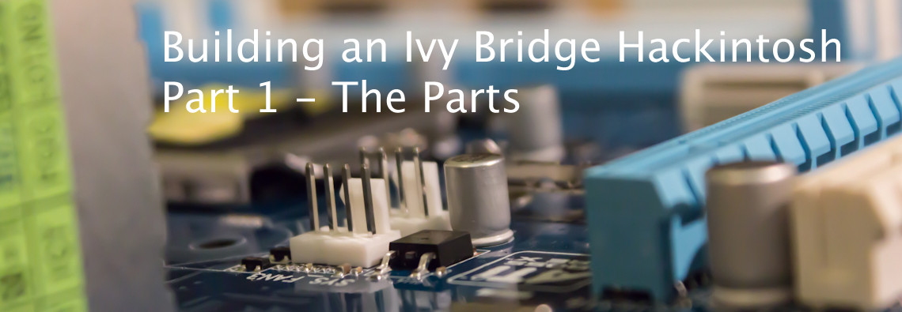

 Since my almost eight years old Mac Pro with it's Dual-Core processor and 3 GB of RAM is getting really slow, and I can't update to Mac OS X Mountain Lion anymore, I decided to get a new computer to install Mountain Lion and Windows 8 on. This Hackintosh should be strong enough for video editing and photo management and fast. In this article series I'm going to write about every step it will take to build and install this Hackintosh. In the next article I will be build the PC. As I already tried to install Mac OS X on normal PCs, I knew that tonymacx86 is a great source for everything that has to do with Hackintoshes. For the parts, I used his [buyer's guide](http://www.tonymacx86.com/339-building-customac-buyer-s-guide-march-2013.html "TonymacX86's buyer's guide"). After doing some further research on the parts, I ended up with the following parts list:

- **Processor:** Intel Core i7-3770 Box
- **Graphics Card:** Gigabyte GeForce GTX 660Ti OC (1344 CUDA Cores)
- **Memory:** 16GB-Kit Corsair XMS3 PC3-10667U
- **Motherboard:** Gigabyte Z77-DS3H
- **Hard Drives:** Two Samsung 840 120GB SSDs, one 1 TB hard drive and one 750 GB hard drive that I still had lying around
- **Case:** FRACTAL DESIGN Define R4 Black Pearl
- **Power Supply:** Corsair Builder Serie CX600 V3 (600 Watts)
- **BluRay Drive:** LG BH16NS40

The whole build cost about 1,150 € which would be about 1495\$ in America. As the motherboard wasn't available on Hardwareversand.de, I ordered it on Alternate.de. It arrived today and the other parts will most likely arrive tomorrow. I'll post the next article when all the parts arrived.
