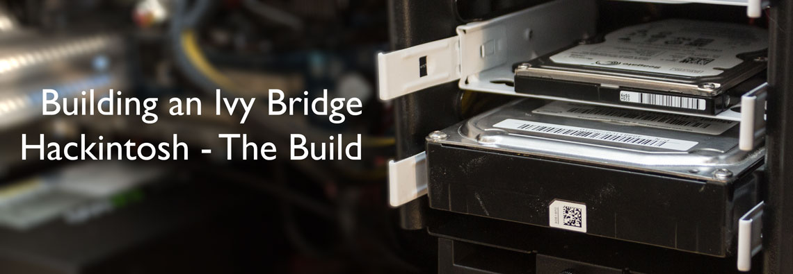
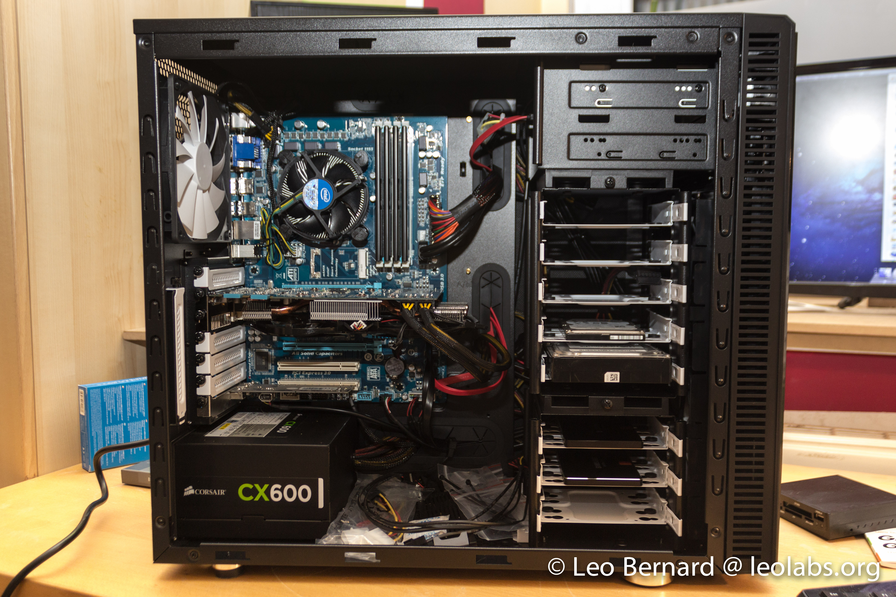

 After having received all the parts that I needed for building my Hackintosh, I immediately started building it together with my good friend [Moritz Gunz](http://neolegends.tk "Moritz's Homepage"). The case was the first thing we unboxed and then laid on the table to install the other components into it. First, we installed the motherboard and the little IO shield that came with it. Installing the IO shield is easy as you just have to snap it into the back of the case. For installing the motherboard, we had to insert some golden placeholder screws into the predefined ATX holes so that the motherboard doesn't touch the case's metal. When we installed the motherboard, we had to insert the screw near the IO shield first as we had to push it so that it's correctly aligned with the placeholder screws. The next things we installed were the processor with its fan and the memory. This was one of the easiest parts as everything just snapped right into where it should be. Then we installed the BluRay drive and the hard drives. The metal holders in the drive bay already had holes for every type of hard drives and it was about the same thing with the BluRay drive. When we installed the PSU, things became a bit difficult as it included many cables that we had to arrange in the case. Luckily, it is possible to hide some of the cables behind the motherboard so they don't get in the way when installing other components. We tried to put as much of the cables as possible behind the motherboard and group them using laces that came with the case. Then we connected everything to the motherboard. There were already some cables in the case for the ports on the front panel and the included fans that we connected first, followed by the power and SATA cables. The last thing we installed was the graphics card. The installation of this part was also easy as it just snapped into the first PCI slot, just like the memory did. As the card needs some more power than the one provided by the slot itself, we connected two graphics card power cables of the PSU. Now, that everything is installed, my new Hackintosh looks like this.  If you don't know where to keep all your case accessories, just put them inside the case itself. That way, you always know where it is and have it handy, when you need it. Now I'm going to install Mac OS X and Windows 8 on the Hackintosh. When everything is up and running, I'll post the next article: The Installation