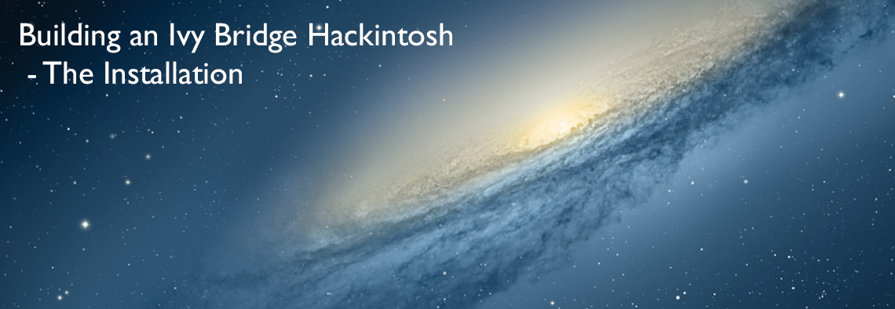
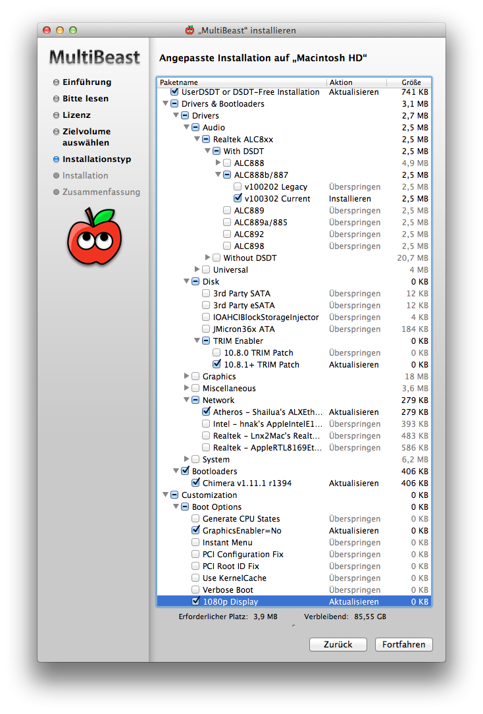
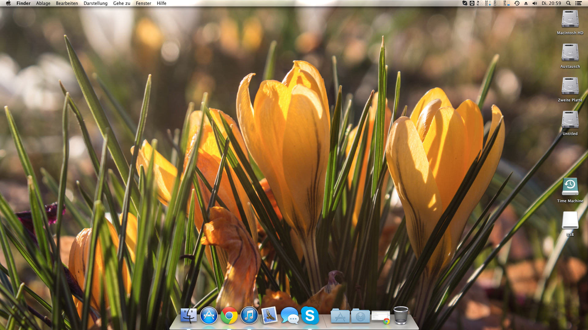
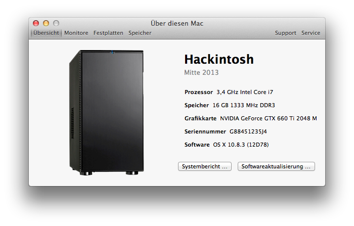

Now that all the components were installed in the case, I turned my Hackintosh on and had to see that the BIOS was always freezing right at the beginning when the GTX 660 Ti was inserted. I already wanted to give the card back and buy another model but then I found out that this is a common problem which can be solved by updating the BIOS to a newer version. After downloading and installing the [firmware version F9](http://www.gigabyte.com/products/product-page.aspx?pid=4326#bios "The download page for the BIOS updates") the boot went just fine.

## Installing Mac OS X

As I couldn't buy Mac OS X Mountain Lion on the App Store from my old Mac Pro because of some compatibility problems which I already mentioned in my [first article](http://leolabs.org/blog/hackintosh-part-1/ "Building an Ivy Bridge Hackintosh – The parts") I downloaded Mac OS X Lion from the App Store first and transferred it onto my USB stick using the [UniBeast Lion](http://www.tonymacx86.com/downloads.php?do=file&id=161 "UniBeast Lion") tool by [Tonymacx86](http://www.tonymacx86.com/ "Tonymacx86's Homepage") (you have to register on his website to get access to his downloads). After plugging my USB stick into the new Hackintosh and booting off it by pressing F12 and selecting the USB stick, I came into the bootloader where I could select the Mac OS X Lion installer. I booted the installer with the bootflag -x - it disables all advanced drivers and kernel extensions which are not needed for the installer to boot - and [installed Mac OS X Lion](http://tonymacx86.blogspot.de/2011/10/unibeast-install-mac-os-x-lion-using.html) onto my first SSD. The installation took about 15 minutes and after that I was able to boot into Mac OS X Lion by using the -x bootflag again. From there, I could download the Mac OS X Mountain Lion image and repeat the whole installation process using the new image. After I booted into Mac OS X Mountain Lion, I downloaded and started [MultiBeast](http://www.tonymacx86.com/downloads.php?do=file&id=155 "MultiBeast on Tonymacx86's Homepage") to install the drivers needed for all of the hardware to work fine with the operating system. For the options I used tkrotoff's article about how to [get Mac OS X working with the Z77-DS3H motherboard](https://github.com/tkrotoff/Gigabyte-GA-Z77-DS3H-rev1.1-Hackintosh "MultiBeast installation instructions"). I also modified the BIOS settings like he recommended.

Now when I turn on my Hackintosh, it boots straight into Mac OS X without any errors and everything works just fine except for the USB 3.0 ports. I haven't found out how to get them working but that's ok for me as I don't own any USB 3.0 devices. It could also be that the USB 3.0 ports only work when a USB 3.0 device is plugged in. This seems to be a common phenomenon with OSx86 systems. Now that everything was installed I downloaded and installed the following essential software:

*   [Google Chrome](http://chrome.google.com "Download Google Chrome") - Browsing the internet
*   [Skype](http://skype.com/ "Download Skype") - Chatting with friends
*   [iStat Menus](http://bjango.com/mac/istatmenus/ "Download iStat Menus") - Overview of the system's status
*   [Textastic](http://www.textasticapp.com/mac.html "Download Textastic") - A simple code editor

Now I can use my Hackintosh as if it is a real Mac. For me, there are no drawbacks at the moment and I can use it without any limitation.

As this is a **Hack**intosh, I wanted to modify the system information page to match my real PC configuration. I found a little tutorial over at the Tonymacx86 forums that explains [how to modify the "About this Mac" window](http://www.tonymacx86.com/customization/79536-mod-about-mac-10-8-a.html). Now my configuration information looks like this:

## Installing Windows

As I also want to play some games on my Hackintosh and run some programs that are not compatible with Mac OS X, I installed Windows 8\. For the installation I had to disconnect every hard drive except for the SSD that I wanted to install Windows on as otherwise there would be an error in the setup which would prevent me from installing Windows. After the installation I installed the [drivers for my nVidia graphics card](http://www.geforce.com/drivers/results/59641 "Download the graphics card's driver") and the [GeForce Experience](http://www.geforce.com/drivers/geforce-experience "Download GeForce Experience") App to optimize the games I play. I also installed the [Stardock Suite](http://stardock.com/products/odnt/information.asp "Download the Stardock Suite (Object Desktop)") to customize the look and feel of Windows and to bring back the good old start menu button. Now, everything is installed and running and my Hackintosh is complete. I hope that this article series helped you a bit on building your own Hackintosh if you tried to. If you have any questions or tips concerning this article series, just leave them in the comments field below.