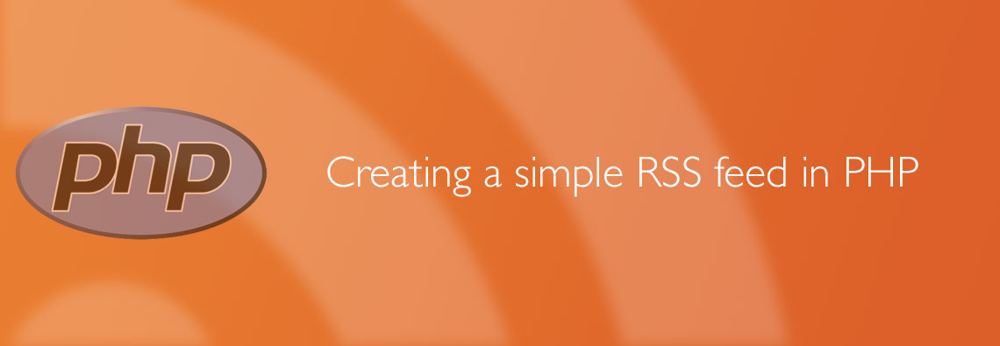

[](assets/2013/06/rss-banner.jpg) In my current project, [#tifnum](http://leolabs.org/blog/tifnum-finding-the-internets-favorite-number/ '#TIFNUM – Finding the internet’s favorite number'), I wanted to add a simple RSS feed, so that interested people can get the newest favorite number every day. After trying out many solutions, I found out that using the SimpleXMLElement  it is one simple way of doing this. Assuming that you have an array containing your articles, e.g. like this:

```php
$entries = array(
    array(
        "title" => "My first test entry",
        "description" => "This is the first article's description",
        "link" => "http://leolabs.org/my-first-article-url"
    ),
    array(
        "title" => "My second test entry",
        "description" => "This is the second article's description",
        "link" => "http://leolabs.org/my-second-article-url"
    ),
    array(
        "title" => "My third test entry",
        "description" => "This is the third article's description",
        "link" => "http://leolabs.org/my-third-article-url"
    )
);
```

Now creating the RSS feed is fairly simple. First you have to tell the browser that the content you want to deliver is a RSS feed, then you create the SimpleXMLElement and tell the RSS reader that you're using the RSS version 2.0:

```php
header("Content-Type: application/rss+xml; charset=UTF-8");

$xml = new SimpleXMLElement('<rss/>');
$xml->addAttribute("version", "2.0");
```

First, let's see what a normal RSS feed looks like:

```xml
<?xml version="1.0" encoding="utf-8"?>

<rss version="2.0">

  <channel>
    <title>Your feed title</title>
    <link>Your website's uri</link>
    <description>Describe your feed</description>
    <language>en-us</language>

    <item>
      <title>Your entry's title</title>
      <description>Your entry's description</description>
      <link>http://my-site.com/article</link>
    </item>

    <item>
      ...
    </item>

  </channel>
</rss>
```

As you can see, the RSS feed contains an element called `<channel>` which contains everything the RSS reader needs to know, including the articles, which are stored in elements called `<item>`. First, we'll add the basic information elements to your feed:

```php
$channel = $xml->addChild("channel");

$channel->addChild("title", "Your feed title");
$channel->addChild("link", "Your website's uri");
$channel->addChild("description", "Describe your feed");
$channel->addChild("language", "en-us");
```

Now, we can add entries from the array to this feed:

```php
foreach ($entries as $entry) {
    $item = $channel->addChild("item");

    $item->addChild("title", $entry['title']);
    $item->addChild("link", $entry['link']);
    $item->addChild("description", $entry['description']);
}
```

Now that everything's done, you can just output the feed using the default echo command:

```php
echo $xml->asXML();
```

And that's it. You now have your own simple RSS feed. If you want to, you can add more information to the feed, like information about the author or the article's date. You can get more information about that in [this Wikipedia article](http://en.wikipedia.org/wiki/RSS) or [here](http://cyber.law.harvard.edu/rss/rss.html). I love using CodeIgniter to create my PHP projects. If you want to create your RSS feed dynamically using a MySQL table, like

| title                | description                              | link                           |
| -------------------- | ---------------------------------------- | ------------------------------ |
| My first test entry  | This is the first article's description  | http://site.org/first-article  |
| My second test entry | This is the second article's description | http://site.org/second-article |
| My third test entry  | This is the third article's description  | http://site.org/third-article  |

You can do this by using CodeIgniter's active record class:

```php
$entries = $this->db->get('my_articles')->result_array();
```

If you have any questions or suggestions concerning this method, just leave them in the comments below this article.
