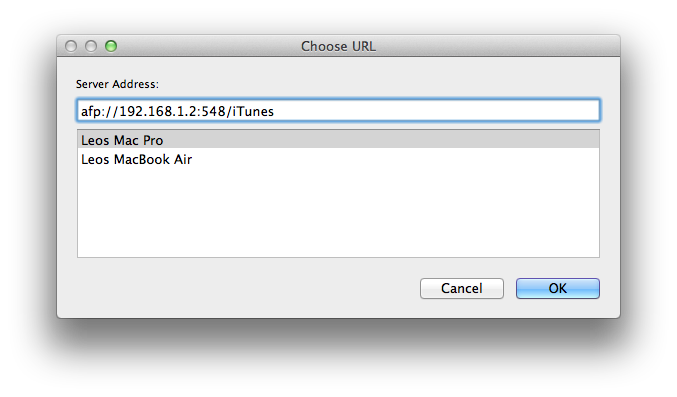

[](assets/2013/06/itunes-sync-banner.jpg)

## Introduction

Last friday, my new [MacBook Air](http://leolabs.org/blog/haswell-macbook-air/ "Testing the 13″ Haswell MacBook Air") arrived and as it's got 512 GB of disk space, I wanted to have my iTunes library on it, so I can hear my music everywhere. After searching for a solution on the internet, I found out that it's pretty simple to keep my iTunes libraries in sync using Automator and a system app called rsync. Setting everything up is very simple and takes only a few steps.

## Step 1: Sharing your iTunes folder in your network

To begin, you will have to enable file sharing in the system preferences of the computer that contains the original iTunes library. Go to sharing and activate the second entry in the list of possible network shares. In German, it's called "Dateifreigabe", so in English it should be called "file sharing" or similar. After that is done, you need to add your iTunes folder to the list of shared folders. This folder is normally called _iTunes_ and located in your _Music_ folder. When you've done that, you'll see that a list of users appeared. If you want to, you can restrict your network share, so that it is read-only. [](assets/2013/06/Bildschirmfoto-2013-06-23-um-11.19.09.png)

## Step 2: Creating the Automator script

The first thing I should tell you before you continue is that you can only sync your iTunes library in one direction using rsync. However it is possible to create this Automator script on both computers and run both to sync your library in both directions, if you want to, but I don't recommend you to do it. Now, to get started, open Automator on your target computer and create a new Workflow. Your window should look like this: [](assets/2013/06/Bildschirmfoto-2013-06-23-um-11.47.00.png) The first thing you want to do is to connect to the computer that contains the original library. To do that, search for "Get specified servers" and drag that entry into your workflow. In the box that appears, click on "Add..." and select your source computer. You'll now see a URI, like "afp://192.168.1.2:548" in the text field over your computer's list. Add a slash and the name of the iTunes folder on your source computer (in most cases "/iTunes") and click "OK". [](assets/2013/06/Bildschirmfoto-2013-06-23-um-11.52.30.png) Next, search for "Connect to servers" and drag that into your workflow, under "Get specified servers". The iTunes library of your source computer is now mounted in your (target) computer. Now, we have to run our rsync command. To do that, search for "Run Shell Script" and drag that into your workflow. In the box that appeared now, insert the following code:
```
rsync -av --force --delete --size-only \
--exclude "Mobile Applications" \
--exclude "Previous iTunes Libraries" \
--exclude "Audiobooks" \
/Volumes/iTunes ~/Music/> ~/Documents/iTunesSync.log
```
The _--exclude_ commands tell rsync which directories shouldn't be synced. If you, for example, don't want to exclude your audiobooks, just remove that line. If you want to exclude an additional folder, just add another line right after the last _--exclude_ command:
```
--exclude "Your folder name" \
```
Your library will now be synced from your source computer to your target computer. Remember, that it only syncs in one direction right now and that files that aren't on the source computer will also be deleted on the target computer. After everything synced, you may want to eject the network share. To do that, search for "Eject disk" and drag that into your workflow. Now, you're done. Your workflow should now look like this: [](assets/2013/06/Bildschirmfoto-2013-06-23-um-12.05.42.png) And that's it. Now, if you start this workflow, your iTunes library should be synced over to the target computer. You can see the current status by opening the file iTunesSync.log in your Documents folder. If this is the first time you sync your library, the process could take a long time depending on how large your library is. Mine is about 40 GB large and it took about 1.5 hours to sync everything over. Now, if you want to, you can save the workflow and put it somewhere so you can access it quickly.

## Pro Tip:

This workflow isn't only limited to syncing iTunes libraries. You can sync any folder from your source to your target computer using this method. Just change the folder names so that they correspond to the folder you want to sync and you're done. As always, if you've got any questions or ideas, just leave them in the comments below and I'll try to answer them.