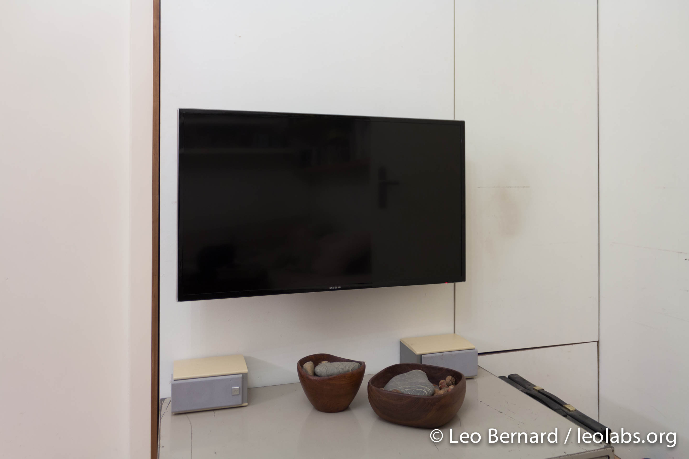
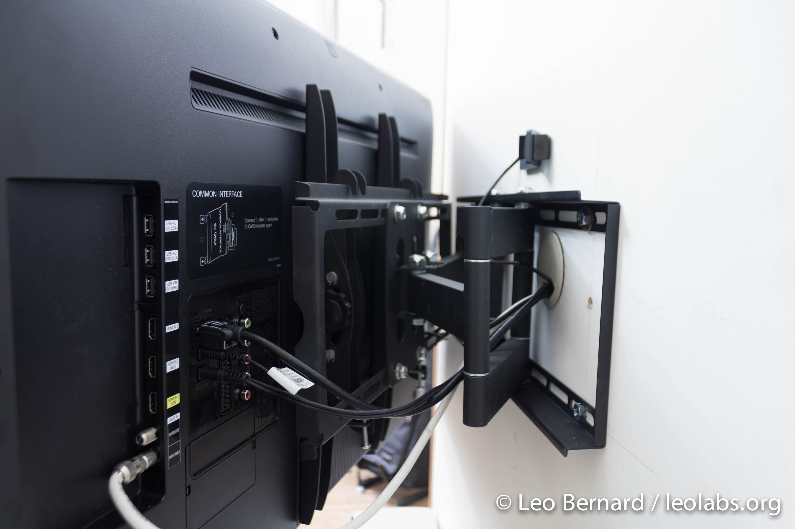

Since I was born, we had an old tube-type television standing in our living room. It wasn't bad to watch TV on it, but it was just bulky and I couldn't attach any modern devices so I used my PC to watch movies. When our DVD player broke last month, we decided to get rid of that old TV and get a nice flat screen television. I decided to go a step further and use this new TV to build a nice media center. After looking for some good and reasonably priced TVs on the internet and reading some reviews, we decided to go with the [Samsung UE40F6470](http://www.amazon.de/gp/product/B00BMKB16Y/ref=as_li_ss_tl?ie=UTF8&camp=1638&creative=19454&creativeASIN=B00BMKB16Y&linkCode=as2&tag=leolabsorg-21 "Samsung UE40F6470 on Amazon") as this is a relatively cheap but still good product which has many good reviews. Also, we ordered a [TV wall mount](http://www.amazon.de/gp/product/B007PRJQLK/ref=as_li_ss_tl?ie=UTF8&camp=1638&creative=19454&creativeASIN=B007PRJQLK&linkCode=as2&tag=leolabsorg-21 "TV wall mount on Amazon") to mount it while still being able to move it a little. For the sound, I added a small amplifier that I got on eBay a few years ago and two speakers that I still had lying around. The media center will run on an [Intel NUC](http://www.amazon.de/gp/product/B00B4O00EM/ref=as_li_ss_tl?ie=UTF8&camp=1638&creative=19454&creativeASIN=B00B4O00EM&linkCode=as2&tag=leolabsorg-21 "Intel NUC on Amazon") which is not too expensive and totally able to play Full HD content while running some other tasks in the background. However, it has not arrived yet. After installing everything, our TV corner now looks like this:

Behind the TV, we drilled a hole to lead the cables to the cabinet on the right side of the picture, so that no cables are visible. This is how the TV looks from behind:

I already put an HDMI cable and a USB extension cord behind the TV to connect it to the Intel NUC. When the NUC arrives, I'll post part two of this article. In the meantime, if you have any questions or suggestions, just let me know in the comments below this article. To continue by reading the second article, click [here](/blog/building-living-room-media-center-part-2/ "Building a living room media center – Part 2: The Intel NUC").
