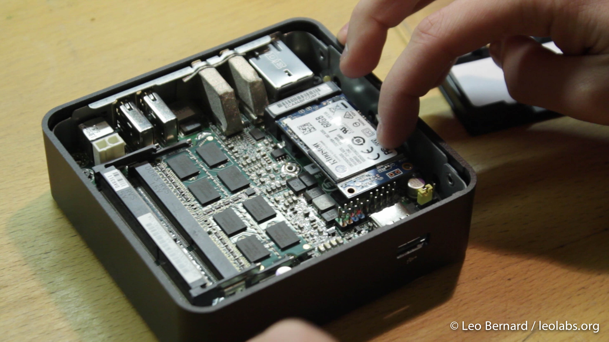

[](assets/2013/12/banner-part-21.jpg)

After some waiting time, the Intel NUC finally arrived. The NUC, or Next Unit of Computing, is a small barebones-computer for about $150 that can be upgraded with an SSD, up to 16 GB of RAM and a WiFi card, if you need one. I chose to order the NUC together with a 60 GB Kingston SSD and 4 GB of RAM which is more than enough to run XBMC, the media center software I will use, smoothly.

[](assets/2013/12/MG_8571.jpg)

After opening the NUC's box, you'll see the NUC itself, as well as a VESA mount to mount it to the back of a PC display, a pack of screws, a manual and an Intel Celeron sticker.

[](assets/2013/12/MG_8566.jpg)

Installing the additional components, in my case the SSD and RAM is easy and takes just a few minutes. First, you remove the bottom cover to get access to the internal components. After that, you can start by taking the RAM and pushing it in the predestined slot. It will just snap into place.

[](assets/2013/12/MVI_8547-1.jpg)

Next, I took the SSD, put it into the next slot and fixed it using one of the screws.

[](assets/2013/12/MVI_8548-1.jpg)

As I will connect the NUC to my network using LAN, I didn't include a WiFi card, so I could skip that step. After then putting the cover back on, you have a fully working PC. One thing that's missing though is the operating system. As I will use the NUC as a media center PC, I chose to install [XBMCbuntu](http://xbmc.org/download/ "Download XBMCbuntu"), a linux distribution that is optimized for running XBMC, but unlike other OSes like OpenElec still provides enough flexibility so that I can install other services to run in the background. The NUC doesn't have a disk drive, so I downloaded [UNetbootin](http://unetbootin.sourceforge.net/ "Download UNetbootin") to copy the image of XBMCbuntu to a USB thumb drive. Installing XBMCbuntu is straight-forward and took about 30 Minutes as my USB thumb drive is not that fast.

[](assets/2013/12/MVI_8560-1.jpg)

However, when I rebooted after the installation, I got stuck with a black screen and a frozen mouse cursor.

[](assets/2013/12/MVI_8560-2.jpg) This seems to be a common issue and luckily there's a solution. I found the [solution on Intel's Community page](https://communities.intel.com/message/192785 "Solution to rc6 bug") to be the best and it worked for me. After that, XBMC would start without any problems.

[](assets/2013/12/Screenshot-2013-12-26-15.47.13.jpg)

I don't really like the default interface design and chose to use the Xperience1080 design which looks a bit like Xbox's home screen.

[](assets/2013/12/Screenshot-2013-12-26-15.47.57.jpg)

Also, I installed some plugins to extend the functionality of XBMC. Some of my favorite plugins are YouTube, Vimeo, TED, arte, Canal+, SoundCloud and TuneIn Radio. In the next step, I wanted to share the hard drive that is connected to the NUC in my network using Samba. If you plug an external hard drive into the NUC, XBMCbuntu will automatically mount it. However, the mounting point is not always the same which is a bit impractical if you want to share it. To set a fixed mounting point, I first ran the command blkid: to find out which UUID my external hard drive has. The third entry is labeled "Externe Daten" which is the partition I want to mount. Also, as you can see, my external hard drive is formatted using HFS+ which is the best file system to use between Mac OS and Linux.

```
leo@mediaserver:~$ sudo blkid
/dev/sda1: UUID="7a50722d-ed81-445c-8891-9e0c26176d5f" TYPE="ext4"
/dev/sda5: UUID="bdf61b58-da88-4785-a37b-768800bf6d83" TYPE="swap"
/dev/sdb1: UUID="3ae678de-cbac-3341-8ca3-3902159d561f" LABEL="Externe Daten" TYPE="hfsplus"
/dev/sdb2: UUID="5b3cac30-ee3e-38d2-967a-b5b9237d464a" LABEL="Time Machine" TYPE="hfsplus"
```

The UUID now has to be included in the file /etc/fstab which tells XBMCbuntu which hard drives should be mounted where and with which options:

```
# /etc/fstab: static file system information.
#
# Use 'blkid' to print the universally unique identifier for a
# device; this may be used with UUID= as a more robust way to name devices
# that works even if disks are added and removed. See fstab(5).
#
# <file system> <mount point>   <type>  <options>       <dump>  <pass>
# / was on /dev/sda1 during installation
UUID=7a50722d-ed81-445c-8891-9e0c26176d5f /               ext4    errors=remount-ro 0       1
# swap was on /dev/sda5 during installation
UUID=bdf61b58-da88-4785-a37b-768800bf6d83 none            swap    sw              0       0

UUID="3ae678de-cbac-3341-8ca3-3902159d561f" /mnt/ext1 hfsplus force,rw
UUID="5b3cac30-ee3e-38d2-967a-b5b9237d464a" /mnt/ext2 hfsplus force,rw
```

The first few lines should already exist in you fstab file. I added the marked lines to the bottom of the file which tell XBMCbuntu to mount the partition with a UUID of "3ae..." (Externe Daten) to the folder /mnt/ext1 and the partition with a UUID of "5b3..." (Time Machine) to the folder /mnt/ext2. Also, the lines tell XBMCbuntu to explicitly mount both partitions read-write which is not the default setting on HFS+ file systems. The folders /mnt/ext1 and /mnt/ext2 still have to be created which can be done with the following commands:

```
leo@mediaserver:~$ sudo mkdir /mnt/ext1
leo@mediaserver:~$ sudo mkdir /mnt/ext2
```

To share your created folders in the network, I installed Samba using:

```
leo@mediaserver:~$ sudo apt-get install samba-common samba
```

Then, I edited Samba's configuration file to include the directories I wanted to share:

```
sudo nano /etc/samba/smb.conf
```

After the changes, my config file looked like this. I didn't share ext2 yet, maybe, I'll do that later:

```
[global]
workgroup = WORKGROUP
server string = MediaServer
security = share
public = yes
unix extensions = no

[Media]
path = /mnt/ext1
comment = Medien-Platte
writeable = yes
browseable = yes
guest ok = yes
force user = leo
```

After a reboot the partitions get mounted to those two folders and shared in the network using Samba. Now, to use the hard drive in XBMC, I can add the ext1-folder. After that, I let XBMC scan my music and movie libraries which took about an hour. Now, I have a fully functional media center with access to my movies, music and many online sources.

[](assets/2013/12/MG_9277.jpg)

To control it with a normal IR remote, I decided to order the [Flirc](http://flirc.tv/ "Flirc") which I will review in the next article. In the meantime, if you have any comments or questions, just leave a reply in the comments below this article :)
