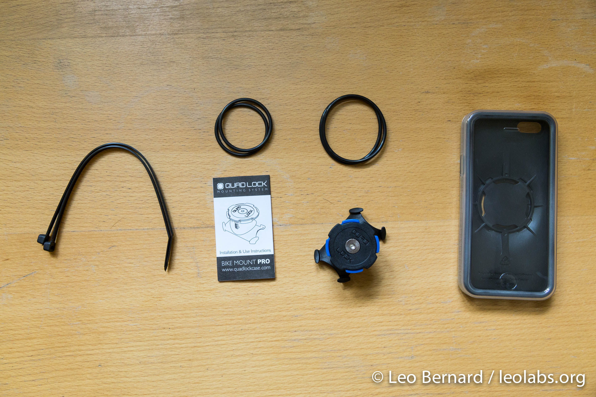
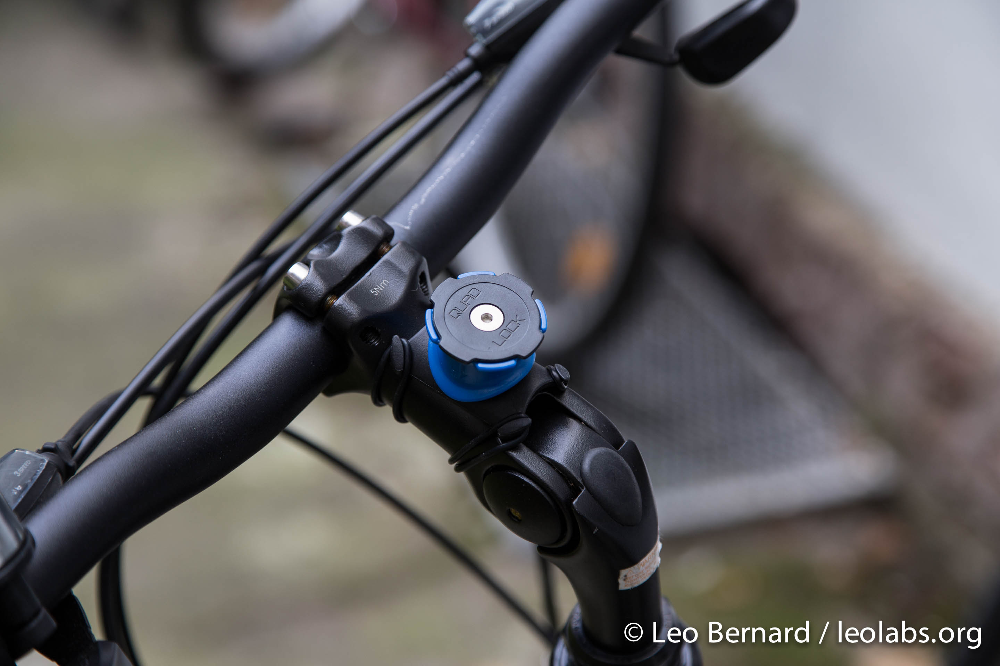

Quad Lock is a smartphone mounting system that allows you to mount your devices on a variety of locations including cars, bikes and other places. The Bike Kit consists of a case for the iPhone 5/5S, a mount for bicycles and the so-called Poncho which you can put over your phone when it's raining. About a month ago, I bought a new bike and decided to get an iPhone mount for it. The Bike Kit costs about 60€ and comes in a compact box.

Inside the box you'll find the case and Poncho itself, the bike mount and some rubber bands to install the bike mount on your bike.

The Quad Lock case itself is made out of a rubber-like plastic. It doesn't slip if you hold it in your hand but if you put it in your pocket, it slips right in. The connector on the back of the case stands out by a few millimeters and coming from an OtterBox Commuter case, I had to get used to this new design.

The Poncho slips right over the case when you need it. It will protect the iPhone from rain, but the back camera is still unprotected.

Installing the Quad Lock bike mount is easy using the two rubber bands. Additionally, you can also use the two zip ties to secure the bike mount on your bike and to make it more difficult for others to steal it. I decided to install it in the center of my handlebars, however you can install it wherever you like.

To mount the iPhone, you just push it on the bike mount and turn it, until it clicks in. You can mount it in portrait and landscape mode, and once it's mounted, it won't unmount until you want it to. I've tried lifting my bike with the case and it still doesn't fall off. Mounting the iPhone takes some time to get used to, but once you know how it works, it doesn't take more than 2 seconds. In the next few weeks, I'll be on a small biking tour. I'll update this article when I'm back home to report how well the case worked there.
