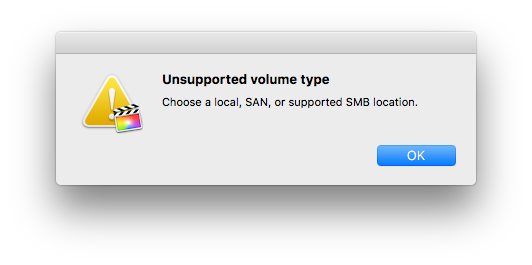

A while ago I started using Final Cut Pro X for my projects and two days ago I bought a Synology DS1817+ to store my project files. The setup was easy but when I tried to open one of my Final Cut projects from the network share using Samba, I got an error message:



I decided to go with SMB since this is the only feasible option here. After some digging, a [support page for Final Cut](https://support.apple.com/en-us/HT207128) shed some light on the potential problem. Apparently, Synology's configuration of the Samba server was missing some modules that are needed for Final Cut to accept the share.

Adding the suggested line to Synology's `/etc/samba/smb.conf` didn't work and caused the connection to fail immediately. Thanks to [a post](https://www.reddit.com/r/synology/comments/62wuu9/which_smb_version_does_dsm_now_run_under_dsm_61/dkhyv4b/) by the Reddit user [/u/TheMonarchsWrath](https://reddit.com/u/TheMonarchsWrath), I was able to find a configuration that works perfectly by following these steps:

SSH into the Synology DiskStation (you have to activate SSH using the web interface first if you haven't done so yet) and gain root access using:

```bash
$ sudo -i
```

Edit the Samba configuration file:

```bash
$ vi /etc/samba/smb.conf
```

Insert the following line at the end (quick vi guide: press `i`, insert the text, then press `ESC`, enter `:wq` and press `ENTER`):

```ini
vfs objects=catia,fruit,streams_xattr
```

Copy the config file to `etc.defaults`:

```bash
$ cp /etc/samba/smb.conf /etc.defaults/samba/smb.conf
```

Restart the Samba server:

```bash
$ /usr/syno/etc.defaults/rc.sysv/S80samba.sh restart
```

And voilà! You can now use your DiskStation to store and edit Final Cut projects 🎉

Pro Tip: To prevent Finder from connecting to the DiskStation using AFP, disable the protocol using the web interface. It is deprecated by Apple anyway and the new versions of SMB are superior.
