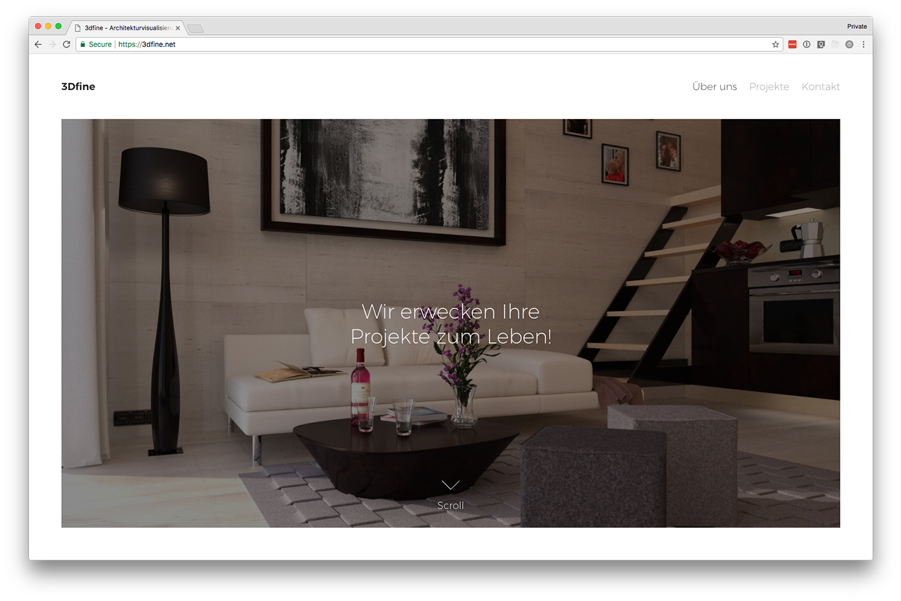

My father does 3D architecture visualization and needed a new website that would look good on all devices, load quickly
and be optimized for images. I opted for a minimalistic design that puts the focus on his images.

The site is built with Victor Hugo and hosted on Netlify. The images are hosted on GitHub and cached and optimized
on the fly using Imgix.

If you'd like to, you can check out the website here: https://3dfine.net (German)
